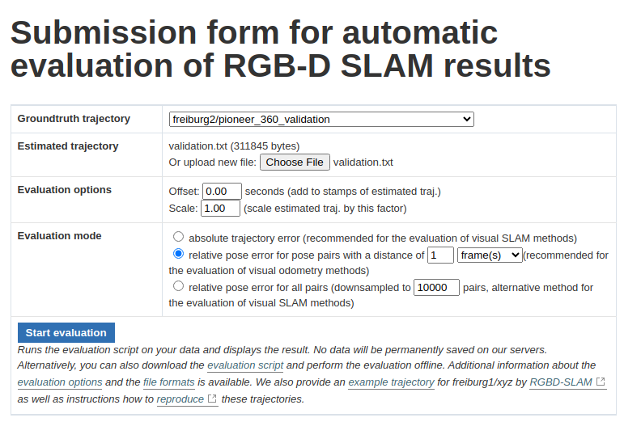
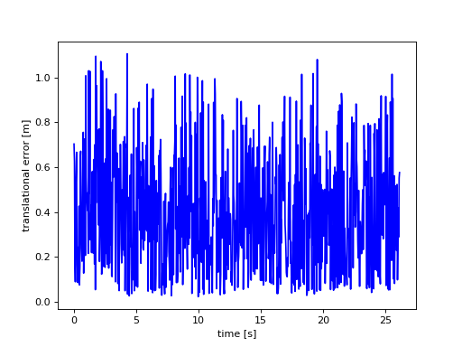
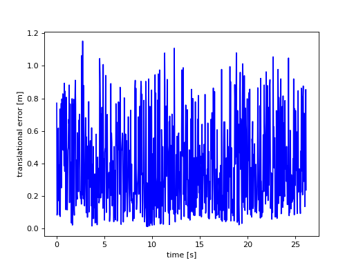

# vo_lstm

## Installation

```shell
$ pip3 install -r requirements.txt
```

## Dataset

The dataset employed in this Visual odometry demo is the [TUM dataset](https://cvg.cit.tum.de/data/datasets/rgbd-dataset/download). Specifically, the following sequences are used to train the model:

- [freiburg2_pioneer_360](https://cvg.cit.tum.de/rgbd/dataset/freiburg2/rgbd_dataset_freiburg2_pioneer_360.tgz)
- [freiburg2_pioneer_slam](https://cvg.cit.tum.de/rgbd/dataset/freiburg2/rgbd_dataset_freiburg2_pioneer_slam.tgz)
- [freiburg2_pioneer_slam2](https://cvg.cit.tum.de/rgbd/dataset/freiburg2/rgbd_dataset_freiburg2_pioneer_slam2.tgz)
- [freiburg2_pioneer_slam3](https://cvg.cit.tum.de/rgbd/dataset/freiburg2/rgbd_dataset_freiburg2_pioneer_slam3.tgz)

You have to download and extract the each sequence into the dataset/train directory.

## Train

First, configure the params to train the model. Check them in the [params.py](params.py) file. Then, run the training script.

```shell
$ python3 train.py
```

## Validation

The [TUM online validation tool](https://cvg.cit.tum.de/data/datasets/rgbd-dataset/online_evaluation) is used to validate the model. For this aim, the following sequences can be used. Download and extract this sequence into the dataset/val directory.

- [freiburg2_pioneer_360_validation](https://cvg.cit.tum.de/rgbd/dataset/freiburg2/rgbd_dataset_freiburg2_pioneer_360_validation.tgz)
- [freiburg1_room_validation](https://cvg.cit.tum.de/rgbd/dataset/freiburg1/rgbd_dataset_freiburg1_room_validation.tgz)
- [freiburg3_walking_rpy_validation](https://cvg.cit.tum.de/rgbd/dataset/freiburg3/rgbd_dataset_freiburg3_walking_rpy_validation.tgz)

Before using the validation tool, generate the position and orientations for the validation sequence. Then, upload the generated file and configure the validation tool setting the sequence length that is the frames per pose.

```shell
$ python3 val.py
```



## Results

Put your results here showing the graphs got from [TUM online validation tool](https://cvg.cit.tum.de/data/datasets/rgbd-dataset/online_evaluation).

## Output 1

# Parameters:
    - LSTM
    hidden_size = 128
    num_layers = 3
    bidirectional = True
    lstm_dropout = 0.3

    - dataset
    sequence_length = 20
    batch_size = 64

    - train
    learning_rate = 0.01
    epochs = 2


# -----------------------------------------------
    compared_pose_pairs 773 pairs
    translational_error.rmse 0.477766 m
    translational_error.mean 0.399521 m
    translational_error.median 0.362075 m
    translational_error.std 0.261998 m
    translational_error.min 0.021337 m
    translational_error.max 1.106553 m
    rotational_error.rmse 21.462463 deg
    rotational_error.mean 18.863456 deg
    rotational_error.median 0.293175 deg
    rotational_error.std 10.237546 deg
    rotational_error.min 0.890160 deg
    rotational_error.max 40.497862 deg
# -----------------------------------------------



## Output 2
    - LSTM
    hidden_size = 64
    num_layers = 3
    bidirectional = False
    lstm_dropout = 0.3

    - dataset
    sequence_length = 20
    batch_size = 64

    - train
    learning_rate = 0.01
    epochs = 2

# -----------------------------------------------
    compared_pose_pairs 773 pairs
    translational_error.rmse 0.468637 m
    translational_error.mean 0.385652 m
    translational_error.median 0.336391 m
    translational_error.std 0.266257 m
    translational_error.min 0.012315 m
    translational_error.max 1.152225 m
    rotational_error.rmse 21.462463 deg
    rotational_error.mean 18.863456 deg
    rotational_error.median 0.293175 deg
    rotational_error.std 10.237546 deg
    rotational_error.min 0.890160 deg
    rotational_error.max 40.497862 deg
# -----------------------------------------------


